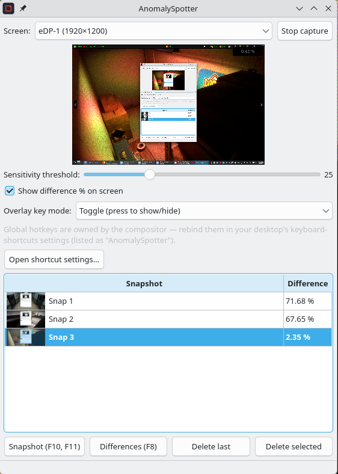

# AnomalySpotter

Anomaly-hunting helper for *Observation Duty*-style camera games. Built first for **Dead Signal**, but it compares screenshots instead of reading game memory, so it works with any game of the genre. It memorizes room/camera snapshots and every 200 ms shows how much the current screen differs from each of them; press F6 to highlight the differences on top of the game.

▶ **[Demo on YouTube](https://www.youtube.com/watch?v=g-LP0PGvYVo)**

## Platforms

Developed and used on **Arch Linux / KDE Wayland**; also runs on **Windows** (X11 should work as
well, just untested). On Windows run the game in **borderless windowed** mode — the overlay cannot
draw above an exclusive-fullscreen game.

Grab the Windows build from the releases, or build from source — see [build.md](build.md).

## Usage

1. Pick the monitor the game runs on and click "Start capture". On Wayland the system shows a screen picker dialog — choose the same monitor.
2. On the first launch KDE asks to allow the global F5/F6 hotkeys — confirm. Without confirmation the hotkeys work only while the trainer window is focused. On Windows the hotkeys are registered automatically.
3. **F5** — save the current frame to memory (room reference).
4. The table refreshes every 200 ms: difference percentage between the current screen and each reference; the best (most similar) one is shown in bold. While capture is running, a small HUD in the top-right corner of the game screen shows the difference % against the best match (toggle with the "Show difference % on screen" checkbox); the HUD corner is excluded from comparison so it never inflates its own percentage. The HUD digits are rendered at double size for readability and turn red at ≥0.5 %, then blink furiously once the difference has stayed ≥2 % for a full second. Above 20 % the whole HUD goes gray — that means no snapshot matches the current view and you probably need to take one here.
5. **F6** — shows the differences against the most similar reference as a red overlay: filled highlight plus outlined boxes for large zones. Comparison is paused while the overlay is up, so the highlight never feeds back into the capture. The "Overlay key mode" selector picks how F6 behaves:
   - **Toggle** (default) — press to show, press again to hide.
   - **Blink** — same as Toggle, but the red highlight flashes 5 times a second, alternating with the game's own pixels. The overlay window itself stays up the whole time (only its content repaints), so compositor window-open/close effects are not retriggered by the blinking.
   - **Hold** — the overlay is visible only while F6 is held down.

   The "Differences" button toggles the overlay with a click in any mode. The mode handling is shared code, so Linux and Windows behave identically.
6. Use the "Delete last" / "Delete selected" buttons to drop a snapshot taken by mistake. "Delete last" also has an optional global hotkey: it is unbound by default — on Wayland assign it in the desktop's keyboard-shortcuts settings ("Delete last snapshot" under AnomalySpotter), on Windows set `deleteLastKey` in the config.
7. The sensitivity threshold suppresses noise from the video codec, the cursor, and small animations. "HUD size" scales the on-screen percentage indicator. "Ignore top pixels" / "Ignore bottom pixels" (0–100) drop horizontal strips at the top and bottom of the screen from the comparison, so a fixed clock, taskbar, or game UI bar there never counts as a difference. "Difference color" picks the highlight color used by the F6 overlay (red by default).

### Changing the hotkeys

The default keys are **F5** (snapshot) and **F6** (overlay). How to rebind depends on the platform,
because on Wayland the compositor owns the global-shortcut binding, not the app:

- **Wayland:** the global shortcuts are registered with the compositor on first run (approve the
  portal prompt). Rebind them in the desktop's keyboard-shortcuts settings — the in-window
  **"Open shortcut settings…"** button opens it (KDE `systemsettings kcm_keys`, GNOME control
  center). They are listed under **AnomalySpotter**, regardless of how the app was started. The
  buttons in the window show whatever is actually bound (the compositor may pick different keys if
  F5/F6 are taken).
- **Windows:** set `snapshotKey` / `overlayKey` / `deleteLastKey` (a function-key number,
  1–12; `deleteLastKey` 0 = disabled, the default) in
  `%APPDATA%\anomaly-spotter\anomaly-spotter.ini` — the in-window **"Edit config…"** button
  opens it in your editor — and relaunch. The same keys in
  `~/.config/anomaly-spotter/anomaly-spotter.conf` apply to the X11 backend.

## Notes

- Pressing F5 while the overlay is visible first hides the overlay and takes the snapshot 350 ms later, so the highlight never lands in a reference.
- References live only in RAM and are gone on exit.
- The overlay is transparent to mouse input and never steals focus from the game.
- The HUD and the diff overlay appear on the screen that is actually being captured: it is detected by matching the frame size against screen resolutions, with the screen selected in the UI as a fallback.
- On Wayland the buttons show the hotkeys actually bound by the portal (KDE may assign different keys if F5/F6 are taken) and update live when the keys are rebound in the system settings.
- On Windows the overlay cannot draw above exclusive-fullscreen games — run the game in borderless/windowed mode.

## Building

See [build.md](build.md) for build instructions (Linux, Windows, the cross-compiled Windows ZIP),
tests, and notes on how the app declares its identity to the Wayland portal.

## License

MIT — see [LICENSE](LICENSE).
